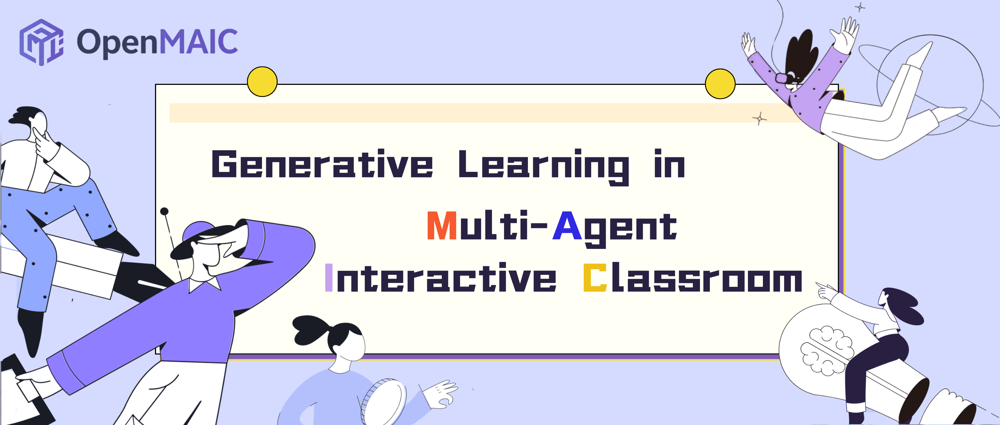
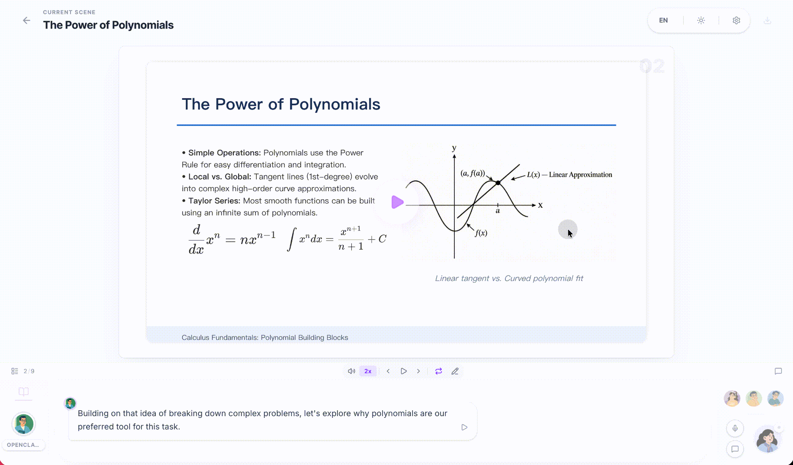
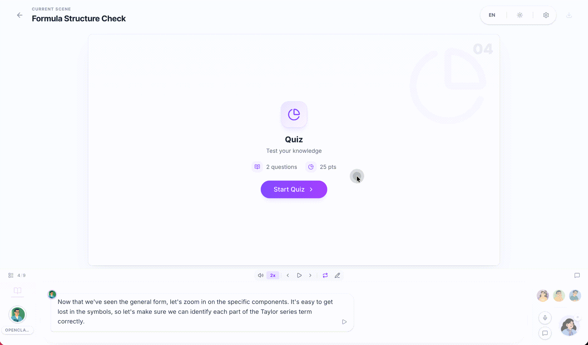
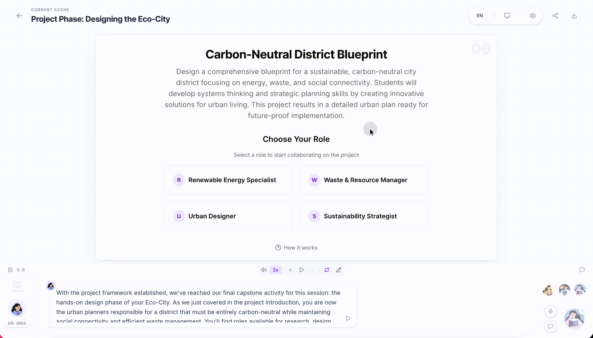
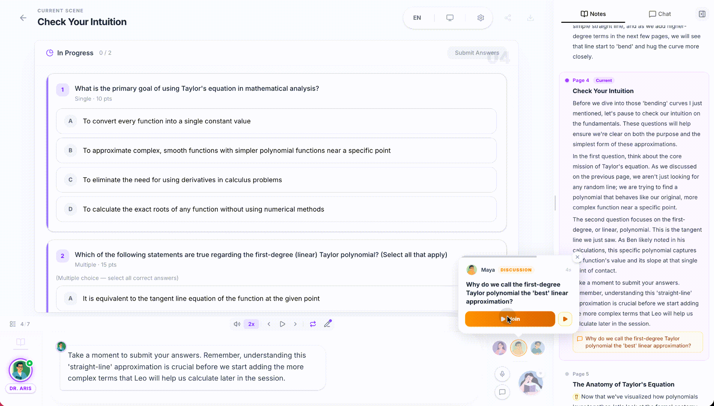

<p align="center">
  
</p>

<h1 align="center">🇮🇳 OpenTutor</h1>

<p align="center">
  <strong>Step-by-step AI tutoring for Indian students</strong><br/>
  <em>AI se seekho — step by step, in your language</em>
</p>

<p align="center">
  
  
  
  
  
</p>

<p align="center">
  📚 <b>Subjects:</b> Class 10 Math | Science | English Grammar | History
</p>

<p align="center">
  🤝 <b>Your Study Squad:</b> AI Teacher | AI Assistant | Sawaal King
</p>

<p align="center">
  <b>Try asking:</b> <br/>
  <i>"Class 9 Maths - Triangles samjhao"</i> <br/>
  <i>"Photosynthesis whiteboard pe explain karo"</i> <br/>
  <i>"History of India batao"</i>
</p>

<p align="center">
  <a href="#-quick-start"><b>🚀 Class Shuru Karo</b></a>
</p>

<br/>

<p align="center">
  <a href="https://open.maic.chat/">Live Demo</a> · <a href="#-quick-start">Quick Start</a> · <a href="#-features">Features</a> · <a href="#-use-cases">Use Cases</a>
</p>


## 📖 Overview

**OpenTutor** (Open Multi-Agent Interactive Classroom) is an open-source AI platform that turns any topic or document into a rich, interactive classroom experience. Powered by multi-agent orchestration, it generates slides, quizzes, interactive simulations, and project-based learning activities — all delivered by AI teachers and AI classmates who can speak, draw on a whiteboard, and engage in real-time discussions with you. With built-in [OpenClaw](https://github.com/openclaw/openclaw) integration, you can generate classrooms directly from messaging apps like Feishu, Slack, or Telegram.

https://github.com/user-attachments/assets/b4ab35ac-f994-46b1-8957-e82fe87ff0e9

### Highlights

- **One-click lesson generation** — Describe a topic or attach your materials; the AI builds a full lesson in minutes
- **Multi-agent classroom** — AI teachers and peers lecture, discuss, and interact with you in real time
- **Rich scene types** — Slides, quizzes, interactive HTML simulations, and project-based learning (PBL)
- **Whiteboard & TTS** — Agents draw diagrams, write formulas, and explain out loud
- **Export anywhere** — Download editable `.pptx` slides or interactive `.html` pages
- **[OpenTutor integration](#-openclaw-integration)** — Generate classrooms from Feishu, Slack, Telegram, and 20+ messaging apps via your AI assistant

---

> [!TIP]
> ###  OpenClaw — Use OpenTutor from your chat app, zero setup
>
> With [OpenClaw](https://github.com/openclaw/openclaw), you can generate classrooms directly from Feishu, Slack, Discord, Telegram, and 20+ messaging apps.
>
> 1. `clawhub install openmaic` or just ask your Claw *"install OpenMAIC skill"*
> 2. Pick a mode:
>    - **Hosted mode** — Get an access code at [open.maic.chat](https://open.maic.chat/), no local setup needed
>    - **Self-hosted** — The skill walks you through clone, config, and startup step by step
> 3. Tell your assistant *"teach me quantum physics"* — done!
>
> 🐾 
> [Learn more →](#-openclaw-integration)

---

## 🚀 Quick Start

### Prerequisites

- **Node.js** >= 20
- **pnpm** >= 10


### 2. Configure

```bash
cp .env.example .env.local
```

Fill in at least one LLM provider key:

```env
OPENAI_API_KEY=sk-...
ANTHROPIC_API_KEY=sk-ant-...
GOOGLE_API_KEY=...
```

For local-first usage with Ollama (no quota limits):

```env
OLLAMA_BASE_URL=http://127.0.0.1:11434/v1
OLLAMA_MODELS=qwen3.5:4b,deepseek-r1:8b,qwen2.5-coder:7b
DEFAULT_MODEL=ollama:qwen3.5:4b
```

You can also configure providers via `server-providers.yml`:

```yaml
providers:
  openai:
    apiKey: sk-...
  anthropic:
    apiKey: sk-ant-...
```

Supported providers: **OpenAI**, **Anthropic**, **Google Gemini**, **DeepSeek**, and any OpenAI-compatible API.

> **Recommended model:** **Gemini 3 Flash** — best balance of quality and speed. For highest quality (at slower speed), try **Gemini 3.1 Pro**.
>
> If you want OpenMAIC server APIs to use Gemini by default, also set `DEFAULT_MODEL=google:gemini-3-flash-preview`.
>
> For hybrid reliability, keep one cloud key configured and use `DEFAULT_MODEL=ollama:qwen3.5:4b`; scene generation will auto-fallback to Ollama when cloud quota/rate limits are hit.

### 3. Run

```bash
Set-ExecutionPolicy RemoteSigned -Scope CurrentUser
pnpm dev
```

Open **http://localhost:3000** and start learning!

### 4. Build for Production

```bash
pnpm build && pnpm start
```


### Docker Deployment

```bash
cp .env.example .env.local
# Edit .env.local with your API keys, then:
docker compose up --build
```

### Optional: MinerU (Advanced Document Parsing)

[MinerU](https://github.com/opendatalab/MinerU) provides enhanced parsing for complex tables, formulas, and OCR. You can use the [MinerU official API](https://mineru.net/) or [self-host your own instance](https://opendatalab.github.io/MinerU/quick_start/docker_deployment/).

Set `PDF_MINERU_BASE_URL` (and `PDF_MINERU_API_KEY` if needed) in `.env.local`.

---

## ✨ Features

### Lesson Generation

Describe what you want to learn or attach reference materials. OpenMAIC's two-stage pipeline handles the rest:

| Stage | What Happens |
|-------|-------------|
| **Outline** | AI analyzes your input and generates a structured lesson outline |
| **Scenes** | Each outline item becomes a rich scene — slides, quizzes, interactive modules, or PBL activities |

<!-- PLACEHOLDER: generation pipeline GIF -->
<!--  -->

### Classroom Components

<table>
<tr>
<td width="50%" valign="top">

**🎓 Slides**

AI teachers deliver lectures with voice narration, spotlight effects, and laser pointer animations — just like a real classroom.



</td>
<td width="50%" valign="top">

**🧪 Quiz**

Interactive quizzes (single / multiple choice, short answer) with real-time AI grading and feedback.



</td>
</tr>
<tr>
<td width="50%" valign="top">

**🔬 Interactive Simulation**

HTML-based interactive experiments for visual, hands-on learning — physics simulators, flowcharts, and more.


</td>
<td width="50%" valign="top">

**🏗️ Project-Based Learning (PBL)**

Choose a role and collaborate with AI agents on structured projects with milestones and deliverables.



</td>
</tr>
</table>

### Multi-Agent Interaction

<table>
<tr>
<td valign="top">

- **Classroom Discussion** — Agents proactively initiate discussions; you can jump in anytime or get called on
- **Roundtable Debate** — Multiple agents with different personas discuss a topic, with whiteboard illustrations
- **Q&A Mode** — Ask questions freely; the AI teacher responds with slides, diagrams, or whiteboard drawings
- **Whiteboard** — AI agents draw on a shared whiteboard in real time — solving equations step by step, sketching flowcharts, or illustrating concepts visually.

</td>
<td width="360" valign="top">



</td>
</tr>
</table>

###  OpenClaw Integration

<table>
<tr>
<td valign="top">

OpenMAIC integrates with [OpenClaw](https://github.com/openclaw/openclaw) — a personal AI assistant that connects to messaging platforms you already use (Feishu, Slack, Discord, Telegram, WhatsApp, etc.). With this integration, you can **generate and view interactive classrooms directly from your chat app** without ever touching a terminal.

</td>
<td width="360" valign="top">


</td>
</tr>
</table>

Just tell your OpenClaw assistant what you want to learn — it handles everything else:

- Generate a classroom outline
